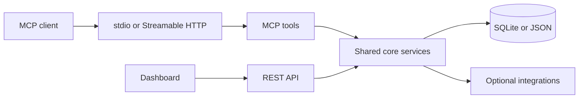

# Job Tracker MCP

[](https://github.com/JHT127/job-tracker-mcp/actions/workflows/ci.yml) [](LICENSE) [](https://www.npmjs.com/package/job-tracker-mcp)

A local-first MCP server for tracking applications, contacts, interviews, follow-ups, and career workflows from Claude or any compatible MCP client.

## Why it exists

Job searches create many small, high-context tasks: remembering status changes, following up at the right time, preparing for interviews, and keeping contact history connected to applications. Job Tracker MCP turns those tasks into validated tools backed by local SQLite storage, with a REST API and dashboard when a visual workflow is useful.

## Features

| Area         | Included                                                                                                       |
| ------------ | -------------------------------------------------------------------------------------------------------------- |
| MCP          | 25 tools, resources, prompts, stdio, and Streamable HTTP                                                       |
| Storage      | SQLite by default, JSON fallback, migration, history, undo, duplicate warnings                                 |
| Workflow     | Applications, contacts, interviews, next actions, stale/conversion/health insights, reports, CSV import/export |
| API          | REST routes, API-key auth, rate limiting, OpenAPI, webhooks, structured errors                                 |
| Integrations | Calendar, Notion, Gmail, Telegram, and generic webhook adapters                                                |
| Dashboard    | Board, timeline, contacts, search, filters, demo mode, dark mode, English/Arabic RTL                           |
| Operations   | Configurable tracker types, redacted logging, Docker image, npm package, generated tool reference              |

## Quick start

```bash
npm ci
npm run build
npm run dev
```

The last command starts the stdio MCP server. To run the REST API instead:

```bash
npm run dev:api
```

To inspect the MCP server interactively:

```bash
npm run inspect
```

Node.js 22 or newer is recommended. Runtime data is created under `data/` and is ignored by Git.

## Use with MCP clients

Build first so the client runs the compiled package. Replace `/absolute/path/to/repo` with the clone location.

### Claude Desktop, macOS and Linux

Typical config file: `~/Library/Application Support/Claude/claude_desktop_config.json` on macOS, or `~/.config/Claude/claude_desktop_config.json` on Linux.

```json
{
  "mcpServers": {
    "job-tracker": {
      "command": "node",
      "args": ["/absolute/path/to/repo/dist/index.js"],
      "cwd": "/absolute/path/to/repo"
    }
  }
}
```

### Claude Desktop, Windows

Use forward slashes in JSON paths:

```json
{
  "mcpServers": {
    "job-tracker": {
      "command": "C:/Program Files/nodejs/node.exe",
      "args": ["C:/Users/YOUR_USERNAME/path/to/repo/dist/index.js"],
      "cwd": "C:/Users/YOUR_USERNAME/path/to/repo"
    }
  }
}
```

### Cursor or VS Code

Register the same command in the client's MCP settings. The command is `node`, the argument is the absolute path to `dist/index.js`, and the working directory is the repository root. Restart the client after changing its configuration.

## Configuration

`tracker.config.json` defines the default `jobs` tracker and alternate `scholarships`, `university`, and `visas` workflows. Set `TRACKER_CONFIG_PATH` to load another file and `TRACKER_TYPE` to select a tracker.

Important environment variables:

| Variable         | Purpose                                                 |
| ---------------- | ------------------------------------------------------- |
| `STORAGE`        | `sqlite` by default; set `json` for the JSON repository |
| `REST_API_MODE`  | Start the REST API on port 3001                         |
| `MCP_HTTP_MODE`  | Start the Streamable HTTP MCP server on port 3000       |
| `API_KEY`        | Require an `X-API-Key` header for REST requests         |
| `LOG_LEVEL`      | Set Pino log verbosity                                  |
| `API_RATE_LIMIT` | Requests allowed per rate-limit window                  |
| `VITE_API_URL`   | Dashboard API base URL                                  |
| `VITE_DEMO=true` | Run the dashboard without a backend                     |

## Dashboard

Live demo: https://jht127.github.io/job-tracker-mcp/

```bash
cd job-tracker-dashboard/job-tracker-dashboard
npm ci
npm run dev
```

For a production build, run `npm run build`. The dashboard uses the API first and falls back to demo data when `VITE_DEMO=true` or the API is unavailable.

## Documentation

- [Architecture](docs/architecture.md)
- [REST API](docs/api.md)
- [Generated MCP tool reference](docs/tool-reference.md)
- [Live demo walkthrough](docs/demo-script.md)
- [Threat model](docs/threat-model.md)
- [Security policy](SECURITY.md)
- [Contributing](CONTRIBUTING.md)
- [Roadmap](ROADMAP.md)
- [Changelog](CHANGELOG.md)

## Tool reference maintenance

The tool reference is generated from the live built MCP server and its actual schemas:

```bash
npm run build
npm run generate:tools
npm run check:tools
```

CI fails when `docs/tool-reference.md` is stale.

## Architecture



## Live demo

The hosted dashboard runs in `VITE_DEMO=true` mode with fictional in-memory data, so visitors can try the board, timeline, contacts, search, theme, language, and Connect Claude views without backend credentials. See [docs/demo-script.md](docs/demo-script.md) for the walkthrough.

## Development

```bash
npm ci
npm run typecheck
npm run lint
npm test
npm run build
```

For package and container checks:

```bash
npm pack
docker build -t job-tracker-mcp:local .
```

The project uses Conventional Commits. See [CONTRIBUTING.md](CONTRIBUTING.md) before opening a pull request.

## License

ISC. See [LICENSE](LICENSE).
