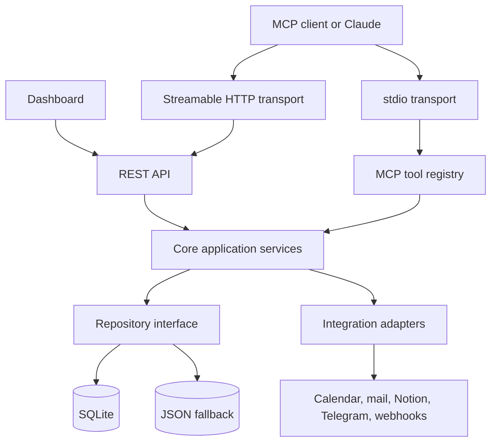

# Architecture

## Runtime boundaries

- `src/tools/` exposes MCP tools, resources, and prompts.
- `src/core/` owns business workflows and is transport-independent.
- `src/repositories/` provides durable storage implementations.
- `src/index.ts` hosts stdio, Streamable HTTP, and REST entry points.
- `job-tracker-dashboard/` is an independent Vite client using the REST API with a demo fallback.

## Data flow

Input is validated at the transport boundary with Zod, then passed to a core service. The repository performs the durable write. Errors return stable API error codes and logs use structured fields with secret redaction.
